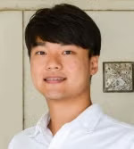
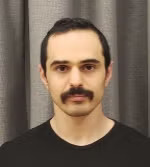

<!-- pages/lab.md -->

<head>
    
</head>

<table>
  <tbody>
  <tr>
    <td>
      

           <a href="{{ site.baseurl }}/lab/ashish/">
            Ashish Deshpande</a> 
            Director and PI    
      

    </td>
  </tr>
    <tr>
      <td>
        
<a href="{{ site.baseurl }}/lab/stefano-dalla-gasperina/">
            Stefano Dalla Gasperina</a>  Post-Doctoral Researcher  
         
</td>
      <td>
        
<a href="{{ site.baseurl }}/lab/gu-cheol-jeong/">
            Gu-Cheol Jeong</a>  Ph.D. Student  
</td>
      <td>
        
<a href="{{ site.baseurl }}/lab/isaiah-scott/">
            Isaiah Scott</a>  Ph.D. Student  
        
</td>
      <td>
        
<a href="{{ site.baseurl }}/lab/job-d-ramirez-gomez/">
            Job D. Ramirez Gomez</a>  Ph.D. Student  
        
</td>
      <td>
        
<a href="{{ site.baseurl }}/lab/haiyun-zhang/">
            Haiyun Zhang</a>  Ph.D. Student Coadvised with Luis Sentis
        
</td>
    </tr>
    <tr>
      <td>
        
<a href="{{ site.baseurl }}/lab/alex-khair/">  Alex Khair</a>  Ph.D. Student  
</td>
      <td>
        
<a href="{{ site.baseurl }}/lab/gabrielle-naquila/">  Gabrielle Naquila</a>  Ph.D. Student  
</td>
    <tr>
    </tr>
    <!--   -->
    <tr style="height:2em">
      <td></td>
    </tr>
    <tr>
      <td style="font-size:1.5em">
          Undergradate students 
      </td>
    </tr>
    <tr>
    </tr>
    <tr>
      <td style="font-size:1.5em">
          Robots
      </td>
    </tr>
    <tr>
    </tr>
    <tr>
  <!-- </tbody>
</table> -->